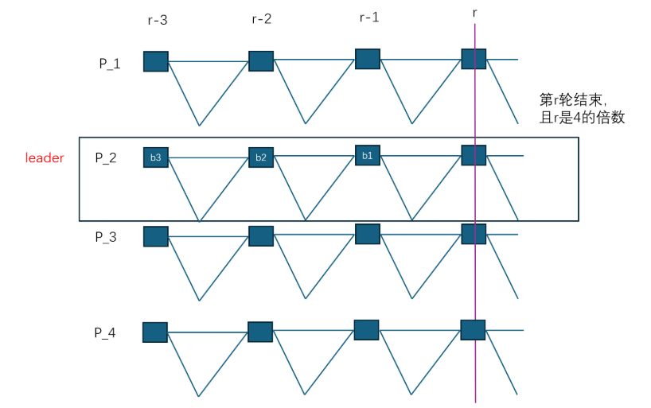

# 基于 DAG-Rider 风格优化的 DAG 共识构图协议（形式化描述草案）

## 1. 系统模型

### 1.1 参与方

系统中有 $n$ 个进程（或副本、节点），记为

$$
\mathcal{P} = \{p_1, p_2, \dots, p_n\}.
$$

其中，最多有 $f$ 个 Byzantine 故障进程，满足

$$
n \ge 3f + 1.
$$

正确进程（honest/correct process）按照协议执行；故障进程可以任意偏离协议。

### 1.2 通信模型

系统采用认证点对点网络或等价的可认证广播信道。即：

- 消息发送者身份不可伪造；
- 正确进程发送的消息最终会被所有正确进程收到；
- 网络可以是部分同步或异步，具体取决于后续整体共识设计，但本节仅描述 DAG 构建机制，不强依赖同步时钟。

### 1.3 轮次

协议按逻辑轮次（round）推进，轮次编号为

$$
r = 0, 1, 2, \dots
$$

每个进程本地维护当前轮次变量 `round_i`。在第 $r$ 轮中，进程 $p_i$ 尝试提出一个属于该轮的区块，并在满足本轮结束条件后进入第 $r+1$ 轮。

## 2. 基本对象定义

### 2.1 区块（Block）

一个区块记为 $b$，其基本属性定义如下：

$$
b = (\mathsf{id}(b), \mathsf{proposer}(b), \mathsf{round}(b), \mathsf{parents}_1(b), \mathsf{parents}_2(b), \mathsf{qc}(b))
$$

其中：

- $\mathsf{id}(b)$：区块唯一标识；
- $\mathsf{proposer}(b) \in \mathcal{P}$：区块提议者；
- $\mathsf{round}(b) = r$：区块所属轮次；
- **下面三个是新增字段**
- $\mathsf{parents}_1(b)$：该区块指向的第 $r-1$ 轮父区块集合；
- $\mathsf{parents}_2(b)$：该区块指向的第 $r-2$ 轮父区块集合；
- $\mathsf{qc}(b)$：提议者上一轮区块对应的 QC（Quorum Certificate），2f+1的投票。

直观上，区块既连接上一轮收到的区块，也连接上上轮收到的足够多的区块，从而形成一个带有跨两轮边的有向无环图（DAG）。

### 2.2 DAG

每个进程本地维护一个有向无环图 $G_i = (V_i, E_i)$，其中：

- $V_i$ 为进程 $p_i$ 当前已知的区块集合；
- $E_i$ 为区块之间的引用边集合。

若区块 $b$ 引用了区块 $b'$，则在 DAG 中存在一条从 $b$ 指向 $b'$ 的有向边：

$$
(b, b') \in E_i.
$$

由于所有引用都只指向更早轮次（$r-1$ 或 $r-2$），故整个图天然满足无环性。

### 2.3 轮次区块集合

对任意进程 $p_i$ 和轮次 $r$，定义其在本地 DAG 中已接收到的第 $r$ 轮区块集合为：

$$
V_i^r = \{ b \in V_i \mid \mathsf{round}(b) = r \}.
$$

若区块 $b$ 由进程 $p_j$ 提出，也可记为 $b_j^r$，表示“由 $p_j$ 在第 $r$ 轮提出的区块”。

### 2.4 投票（Vote）

当节点对某个区块进行投票时，投票消息定义为：

$$
v = (\mathsf{voter}(v), \mathsf{round}(v), \mathsf{target}(v))
$$

其中：

- $\mathsf{voter}(v) \in \mathcal{P}$：投票者；
- $\mathsf{round}(v) = r$：投票者当前所处轮次；
- $\mathsf{target}(v)$：该投票所针对的区块标识。

这里投票显式包含三个信息：

1. 投票的人；
2. 投票人所在的轮次；
3. 被投票的目标区块。

**实现的时候可以直接在原来的结构体里加一个字段，不需要新的结构体**

### 2.5 法定证书（QC, Quorum Certificate）

对于某个区块 $b$，若存在一个投票集合 $Q_b$，满足：

1. 所有投票都以 $b$ 为目标；
2. 所有投票均来自不同的进程；
3. 投票数量不少于 $2f+1$；

则称 $Q_b$ 构成区块 $b$ 的一个 QC，记为：

$$
\mathsf{QC}(b) = Q_b.
$$

形式化地，若

$$
Q_b = \{v_1, v_2, \dots, v_k\}, \quad k \ge 2f+1
$$

且对任意 $v \in Q_b$ 有：

$$
\mathsf{target}(v) = \mathsf{id}(b),
$$

并且这些投票来自至少 $2f+1$ 个不同进程，则称 $b$ 已获得 QC。

## 3. 区块构造规则

### 3.1 第 $r$ 轮区块的构造

当进程 $p_i$ 进入第 $r$ 轮时，它构造一个新区块 $b_i^r$。

该区块包含以下引用关系：

#### （1）连接到第 $r-1$ 轮收到的所有区块

设进程 $p_i$ 在构造 $b_i^r$ 时，已经收到的第 $r-1$ 轮区块集合为 $V_i^{r-1}$，则要求：

$$
\mathsf{parents}_1(b_i^r) = V_i^{r-1}.
$$

即，$b_i^r$ 要连接到其在上一轮收到的所有区块。

#### （2）连接到第 $r-2$ 轮收到的区块，且数量至少为 $2f+1$

设进程 $p_i$ 在构造 $b_i^r$ 时，已经收到的第 $r-2$ 轮区块集合为 $V_i^{r-2}$。协议要求 $b_i^r$ 连接到其中不少于 $2f+1$ 个区块，即：

$$
\mathsf{parents}_2(b_i^r) \subseteq V_i^{r-2}, \quad |\mathsf{parents}_2(b_i^r)| \ge 2f+1.
$$

根据协议描述，这里可理解为：

- 若 $p_i$ 已收到的第 $r-2$ 轮区块数量超过 $2f+1$，可以选择其中某个满足条件的集合；
- 若采用更强版本，也可直接引用已收到的所有第 $r-2$ 轮区块，只要其中数量至少为 $2f+1$。

#### （3）包含提议者上一轮区块的 QC

设 $p_i$ 在第 $r-1$ 轮曾提出区块 $b_i^{r-1}$，且其已经收集到一个 QC，则新区块中携带该 QC：

$$
\mathsf{qc}(b_i^r) = \mathsf{QC}(b_i^{r-1}).
$$

也就是说，第 $r$ 轮区块中嵌入提议者自己在第 $r-1$ 轮区块的法定证书。

### 3.2 创世情形（初始化）

由于第 $0$ 轮和第 $1$ 轮可能不存在 $r-1$ 或 $r-2$ 轮，因此需要定义初始化规则。可以采用如下方式：

- **第 0 轮**：每个进程提出一个 genesis 后继区块，不包含前驱引用，仅作为 DAG 起始层；
- **第 1 轮**：连接到第 0 轮已收到的区块，不要求 $r-2$ 轮引用；
- **第 $r \ge 2$ 轮**：完整执行上述双层引用规则。

更形式化地：

- 若 $r = 0$，则

$$
\mathsf{parents}_1(b_i^0)=\emptyset,\quad \mathsf{parents}_2(b_i^0)=\emptyset,\quad \mathsf{qc}(b_i^0)=\bot
$$

- 若 $r = 1$，则

$$
\mathsf{parents}_1(b_i^1)=V_i^0,\quad \mathsf{parents}_2(b_i^1)=\emptyset,\quad \mathsf{qc}(b_i^1)=\mathsf{QC}(b_i^0)\ \text{或}\ \bot
$$

- 若 $r \ge 2$，按标准规则执行。

## 4. 广播与投票规则

### 4.1 区块广播

进程 $p_i$ 在构造完成第 $r$ 轮区块 $b_i^r$ 后，将该区块广播给所有进程。

广播内容至少包括：

- 区块标识；
- 提议者身份；
- 轮次；
- 所有父区块引用；
- 携带的 QC。

### 4.2 投票触发条件

协议中的投票规则如下：

对于任意进程  $p_j$，当其收到一个来自进程 $p_i$ 的第 $r$ 轮区块 $b_i^r$，且该区块通过基本合法性检查后，$p_j$ 立即对其发送投票：

$$
v_{j \to b_i^r} = (p_j, r_j, \mathsf{id}(b_i^r))
$$

其中 $r_j$ 为 $p_j$ 发送该投票时的当前本地轮次。

### 4.3 区块合法性检查

为保证投票对象有效，节点在投票前至少应验证：

1. 区块提议者身份与签名合法；
2. 区块轮次字段正确；
3. 所引用的父区块确实存在于本地 DAG 中，或可随消息一起验证；
4. 若 $r \ge 2$，则该区块引用了：
   - 所有本地已知的第 $r-1$ 轮区块（这是本地视角的规则，严格实现上需要澄清）；
   - 至少 $2f+1$ 个第 $r-2$ 轮区块；
5. 区块中携带的 QC 与其上一轮自身区块相匹配。

### 4.4 QC 收集

区块提议者 $p_i$ 在广播 $b_i^r$ 后，持续收集针对该区块的投票。当其收集到不少于 $2f+1$ 个来自不同进程的有效投票时，认为该区块已形成 QC：

$$
|\mathsf{QC}(b_i^r)| \ge 2f+1.
$$

## 5. 轮次推进规则

### 5.1 第 $r$ 轮结束条件

对进程 $p_i$ 而言，第 $r$ 轮在满足以下两个条件时结束：

#### 条件 1：自己的第 $r$ 轮区块收集到 $2f+1$ 个投票

即：

$$
|\mathsf{QC}(b_i^r)| \ge 2f+1.
$$

#### 条件 2：自己至少收到了 $2f+1$ 个第 $r$ 轮区块

即：

$$
|V_i^r| \ge 2f+1.
$$

其中 $V_i^r$ 表示 $p_i$ 本地已收到的第 $r$ 轮区块集合。

### 5.2 进入下一轮

当且仅当以上两个条件同时满足时，进程 $p_i$ 从第 $r$ 轮进入第 $r+1$ 轮，并重复执行：

1. 构造新区块 $b_i^{r+1}$；
2. 连接 $r$ 轮和 $r-1$ 轮满足条件的父区块；
3. 附带 $\mathsf{QC}(b_i^r)$；
4. 广播新区块；
5. 等待投票和足够多的同轮区块。

## 6. 提交条件

基础版本，不使用流水线，每个wave包含4个round，具体逻辑为：

对于副本$p_i$，当第r轮结束时（满足5.1的提交条件）：

* 判断r是否为4的倍数
  * 如果不是，进入下一轮
  * 如果是，通过Common Coin或Round Robin找到r-3轮的leader，记为$l_{r-3}$
    * 设$b_3, b_2, b_1$分别为$l_{r-3}$在第r-3, r-2, r-1轮出的块
    * 如果$p_i$收到了$b_3, b_2, b_1$，那么检查$b_1$中包含的针对$b_2$的$QC(b_2)$，以及$b_2$中包含的针对$b_3$的$QC(b_3)$
      * 这两个QC中所有的投票的round（见2.4的定义），如果都小于r，那么$b_3$ 就满足提交条件 

* 如果$b_3$满足提交条件，和其他DAG协议一样，需要向前溯源进行递归提交